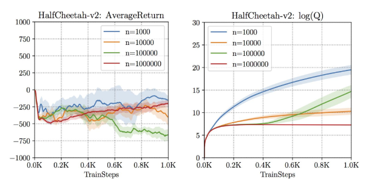

### Offline RL

[ref : BAIR](https://bair.berkeley.edu/blog/2019/12/05/bear/)

---

      SAC, PPO, Rainbow 등 알고리즘이 robot manipulation, atari game 등과 같이 
      challenging domain에서 sample-efficient한 성능을 보여주었다.

      근데 이 방법들 모두 여전히 어느정도의 online data collection이 필요하고,
      fullly off-policy data에서의 학습은 여전히 제한적임.

fully off-policy SAC - works poorly

      그럼 왜 현재 존재하는 RL 알고리즘들은 fullly off-policy setting에서 실패할까?
      해결 방법은 무엇일까?

- `Offline RL?`
 
      Offline RL은 환경과의 상호작용 없이 agent를 학습시키는 방법론이다. 
      Exploration이 어렵거나 cost가 높은 환경에서 사용할 수 있다. 

- `Challenge`

      가장 명확한 문제점은 OOD (out-of-distribution) action에 대한 문제이다.
      - OOD action에 대해서 agent가 이상할 만큼 크게 Q value를 평가한다. (Q-learning setting 에서)
      * BAIR reference 참고

- `Learning in the presence of OOD actions`

      그럼 OOD action들에 영향을 받지 않고서 어떻게 static data에서 RL 알고리즘을 학습시킬 수 있을까?

      - BC based method :
        
        static dataset이 전문가에 의해 만들어졌다면, imiation learning처럼 expert policy를 흉내내는 BC를 쓸 수 있다. 
        조금 더 일반적인 상황에서는, 전체 static dataset에서 subset of good action decision만을 흉내낼 수 있다. 
        
        이 방법은 dataset에서 확인되는 action 들에만 기초해서 학습되기 때문에 OOD action에서 완전히 벗어날 수 있다. 

      - DP method : 

        DP method는 fully off-policy RL 환경에서 꽤나 좋은 선택이다. 
        BC method는 implicit하게 best performance trajectory가 static datset 안에 있다는 확신 하에서 수행하지만, 
        DP method는 전체적인 trajectory에서 information을 모을 수 있는 능력이 있다.

        예를 들어, MDP 상의 all transition를 포함한 dataset에서 Q-Learning을 수행하면 반드시 optimal policy를 얻는다.
        반면에 BC method는 각각의 indivisual trajectory들이 매우 suboptimal이라면 may fail to recover optimality. 

        BCQ 알고리즘은 learned policy가 behavior policy의 distribution과 가깝도록 제한하는 방법이다. 
        이 방법은 static dataset이 expert policy에서 나온 것들로 구성된다면 아주 optimal한 방법이다
        하지만 만약 static dataset이 suboptimal policy 들에서 모아진 것들이라면, suboptimal하게 수렴할 수 있다. 
          - 즉, dataset의 quality가 매우 중요하다. 

        외에 G-Learning, KL-Control, BRAC, SPIBB 등의 방법들이 있다. 

- `Optimistic view`

      offline RL이 online RL 만큼의 성능을 보이기 위해서 그냥 뭔가 특별히 더 해줄 필요가 없다.
      다만 더 강력한 off-policy 알고리즘을 쓰라는 것이다.
      어쩌면 단순히 [강력한 off-policy 알고리즘 + 방대한 데이터를 사용하는 것 + offline setting]
      의 조합이면 해결될 지도 모르겠다.

[optim ref1](https://arxiv.org/abs/1910.01708)  
[optim ref2](https://arxiv.org/abs/1907.04543)
      

---

- `Proposed methods`

      # Navie method :

        - FQI : offline batch version of Q-learning. No guaranteed convergence 
        - NFQ : FQI with neural network. 

      # Policy Constraint :

        Constrain the learned policy to be similar to the behavior policy of the dataset.

        - BCQ   : Directly constrain learned policy using perturbation model.
        - BEAR  : With MMD, constrain learned policy via dual GD.
        - BRAC  : Adapts KL divergence to constrain the learned policy.    

      # Regularize Q-function :

          OOD action을 underestimate 하도록 Q function regularization하는 방법.

          - CQL   : OOD action에 페널티를 주며 true Q function보다 더 낮은 Q function을 학습.
          - F-BRC : Fisher-divergence를 이용한 Critic regularization method.
                    this can be interpreted as policy constraint method
                    - fisher-divergence denotes a penalty in terms of distance
                      between the learned policy and the behavior policy in the dataset.
            
      # Advantage-weighted method :

        Utilizing advantage function for policy updates by learning 'good' actions with higher weights.

        - MARWIL : Monotinic advantage re-weighted imitation learning
        - AWR    : Advantage-weighted regression
        - AWAC   : Advantage-weighted actor-critic
        - CRR    : Critic regularized regression
  
          * AW는 Imitation learning 과 online RL에서 준수한 성능을 보인다.
            근데 fixed dataset에 대해서는 성능 향상이 있긴 하지만, 눈에 띌만한 향상은 보이지 못한다고 한다.
            (이유는 차차 공부해보자.)
            So, 이 한계를 극복해서 offline RL에서 써보면 어떨까? 많은 사람들이 이미 그러고 있다.

      # Combination of RL+BC
    
        RL+BC : Simply applies the BC to the policy update of an online RL algorithms.

        - SAC+BC (AWAC)
        - TD3+BC
        - TD3+DABC : 한결

          *Behavior Cloning (BC) : 
  
          BC는 offline RL에서 OOD 문제를 다룰 수 있는 가장 간단하고 실용저인 policy constraint 방법.
          하지만 behavior policy의 행동과 learned policy의 행동 간의 error 만 고려하기 때문에,
          low-quality의 dataset을 가지고 학습할 때에는 좀 문제가 있다. 
        
        
      

##### 출처 : 한결이 졸업 논문
